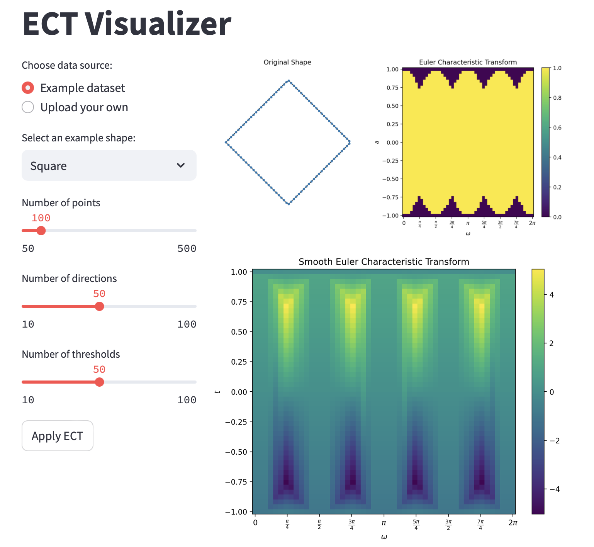

# ECT Visualizer

A Streamlit app to visualize the Euler Characteristic Transform (ECT) for 2D shapes.



## Quick Start

1. Clone the repo:
   ```
   git clone https://github.com/yourusername/ect-visualizer.git
   cd ect-visualizer
   ```

2. Set up (using uv):
   ```
   uv venv
   source .venv/bin/activate  # On Windows: .venv\Scripts\activate
   uv pip sync requirements.txt
   ```

   Or with pip:
   ```
   python -m venv venv
   source venv/bin/activate  # On Windows: venv\Scripts\activate
   pip install -r requirements.txt
   ```

3. Run:
   ```
   uv run streamlit run app.py
   ```
   Or if using pip:
   ```
   streamlit run app.py
   ```

4. Open `http://localhost:8501` in your browser.

## Features

- Generate sample 2D shapes or upload custom datasets
- Visualize original shape, ECT, and Smooth ECT
- Adjust ECT parameters

## License

MIT